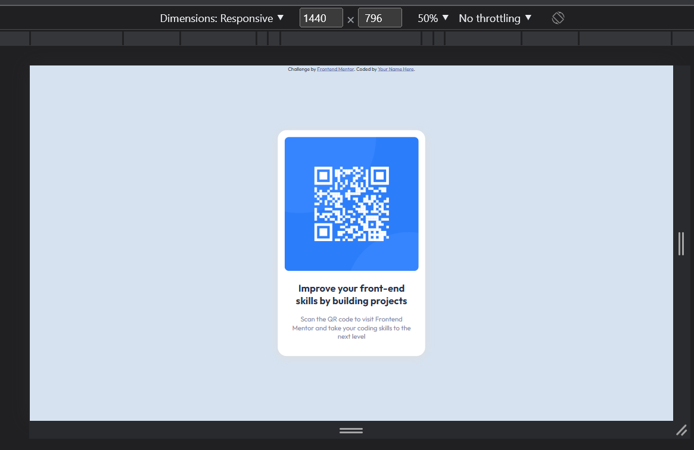
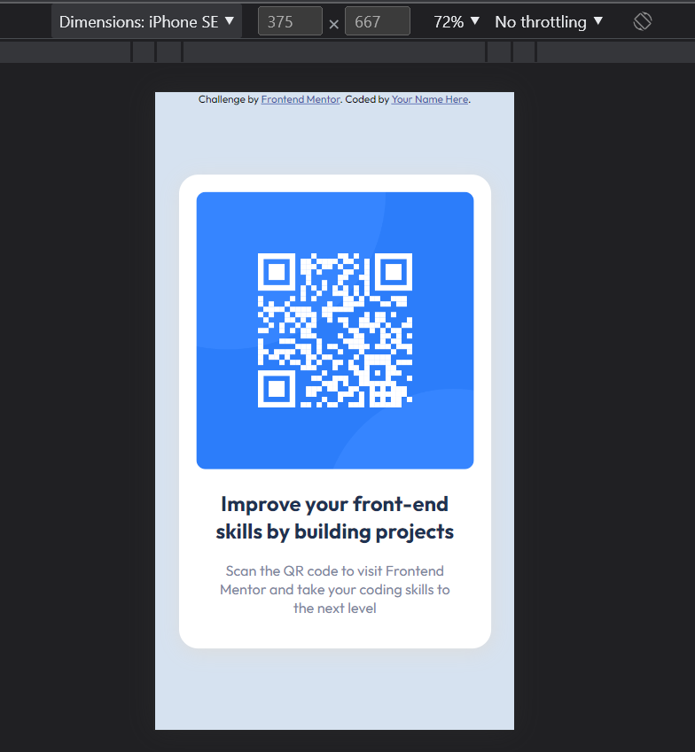

# Frontend Mentor - QR code component solution

This is a solution to the [QR code component challenge on Frontend Mentor](https://www.frontendmentor.io/challenges/qr-code-component-iux_sIO_H). Frontend Mentor challenges help you improve your coding skills by building realistic projects. 

## Table of contents

  - [Screenshot](#screenshot)
  
  - [Links](#links)

  - [Built with](#built-with)
 
  - [Continued development](#continued-development)

  - [Author](#author)

### Screenshot

### Links

- Solution URL: [Add solution URL here](https://your-solution-url.com)
- Live Site URL: (https://weddingrafix.com/frontendmentor/qrcode/index.html)

### Built with

- Semantic HTML5 markup
- CSS custom properties
- Mobile-first workflow

### Continued development

loved to deepen my knowledge in css, and javascript, and later on backend dev as well.

## Author

- Website - [firkaak -MillokTamás](https://www.weddingrafix.com)
- Frontend Mentor - [@firkaak](https://www.frontendmentor.io/profile/firkaak)

